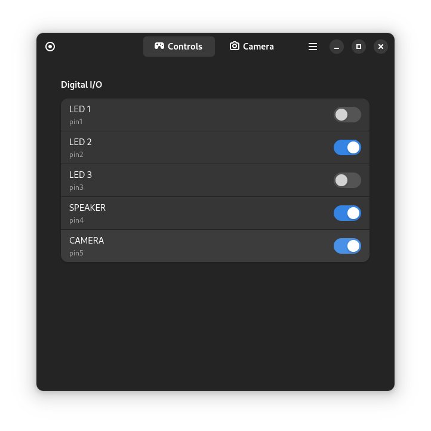

# ESP-VIEWER

## Overview
This app aims to be Graphical User Interface for ESP-CAM boards. It is still in early development. 

## Installation 
This app is packaged as flatpak, follow [official flatpak guide](https://flatpak.org/setup/) on how to setup and run apps, maybe someday it will land on [flathub](https://flathub.org/)...

Also ths app was build with [gnome-builder](https://developer.gnome.org/documentation/introduction/builder.html), it is recommended to use this software to test and edit code.

## Docs

Please refer to files in `docs` folder to get in depth information. 