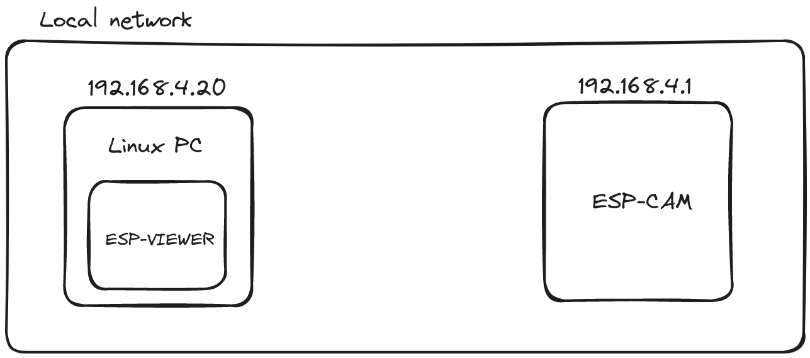
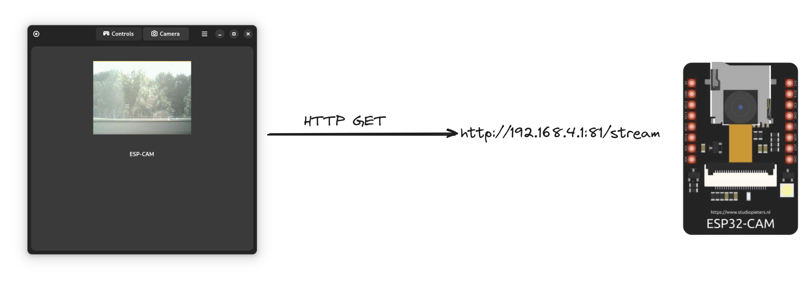
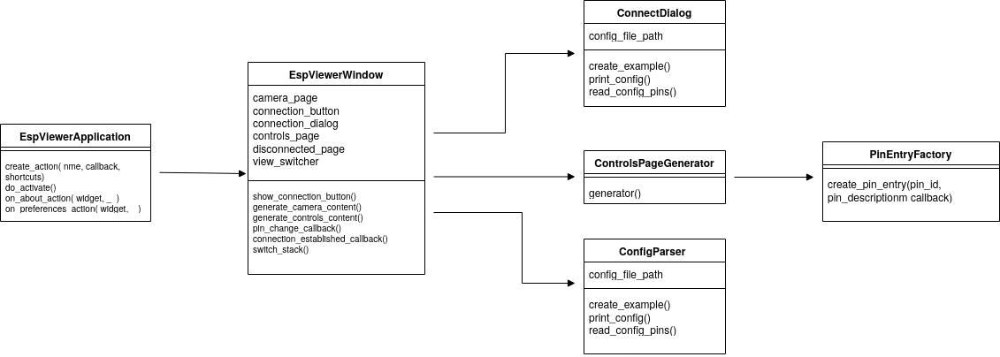

# esp-viewer documentation

## Overview
This project aims to provide an useful GUI to communicate with esp-cam board. This app is deticated for GNOME ecosystem. 

## Working principles

The idea is to connect esp-cam board wih gui app to provide ease of control of esp. Esp-Cam was flashed with software based on official [esp-who](https://github.com/espressif/esp-who). After boot esp hosts a website at port 81 that is used to interact with esp-viewer app. You can inspect website by entering IP address in the the browser of your choosing, default esp address is [192.168.4.1](192.168.4.1). 

The communicaton between the app and the board is based on http post and get methods, which are used on website host by esp. Pin changes triggered by toggling switches in *Controls* page of the app send HTTP POST message containign **pin_id** and **pin_state**. Camera stream is captured by requesting stream from `\stream` file accesible from webiste using HTTP GET.

The project is using [GTK](https://www.gtk.org/) and [LibAdwaita](https://gnome.pages.gitlab.gnome.org/libadwaita/) to provide pretty looking GUI. Esp-viewer was designed as event-driven architecture, which means user interactions trigger certain functions. Addtionaly [flatpak](https://www.flatpak.org/) is used to povide ease of instalation. 

## Used modules
This app uses several Python modules in order to work. 

- `requests` - for establishing communicaton & HTTP POST/GET methods, 
- `toml`- for parsing TOML files,
- `opencv-python`- for dealing with camera stream

## Directory Structure
The project is separated into several directories which are listed below:

- `data` - contains static data such as icons neccessary for making the app look nicer
- `docs` - contains project's documentation in Markdown
- `po` - contains potfiles
- `src` - contains app Python sources
    - `ui`- contains .ui(XML) files 

## Sources
List of python sources:

- `main.py` - contains main application class
- `window.py`- contains main window class
- `configparser.py` - contains class responsible for dealing with TOML config file
- `connect.py` - contains classes responsible for connection with esp-board
- `controls.py` - contains class that takes care of *controls* page
- `stream.py` - contains class responsible for processing camera stream

For initial gui setup XML files are used.

- `window.ui` - XML file describing look of main window
- `about.ui` - XML file describing look of *about* dialog
- `connect_dialog.ui` - XML file describing look of *connect* dialog

Other important files: 

- `meson.build` - meson buildsystem configuration files
- `esp_viewer.yackcheck.io.json` - flatpak manifest file

## Class diagram

