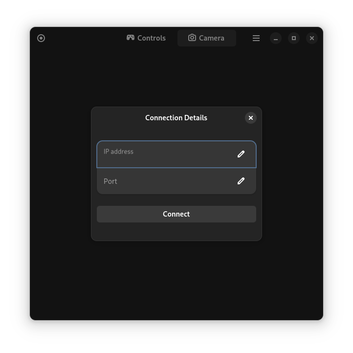
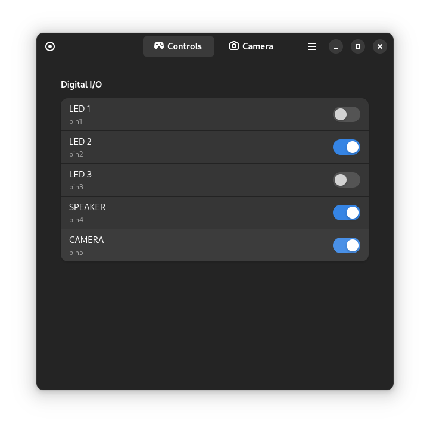

# Manual

## Estabilishing connection with esp-boad
After launching esp-viewer you will be greeted with view:


App gui consists of top bar and page viewer. You can navigate the app using buttons located on the top bar. The circle button located in the top left corner is `connect button`, it is used to esablish connection with esp-cam board. After clicking it you should see connection details dialog. 



In this dialog you should enter connection details, if left empty it will default to ip=192.168.4.1 and port=81. After estabilishing a connection *Controls* and *Camera* pages should be populated. 


## Usage after successful connection 
### Controls Page
After sucessful connection *Controls* page should display list of available options(pins) that you can toggle. 



The list of pins that you can toggle can be specified in custom **config file**. This file is location depends on *XDG_CONFIG_HOME* environment variable, in case of flatpak installation it should be at `~/.var/app/esp_viewer.yackcheck.io/config/ev_config.toml`. The TOML was chosen as it provides high readability, and for now only digital pin configuration in supported. Edit `digital_pins` list to set custom pinout. Example of `ev_config.toml` content: 

```toml
[ Board ]
name = "esp-cam"
model = "esp-cam"

digital_pins = [ ["pin1", "pin2", "pin3", "pin4", "pin5"], ["LED 1", "LED 2", "LED 3", "SPEAKER", "CAMERA"] ]

```
The app sends HTTP POST method to send *pin_id* along with  *new_state* to esp-board. 

### Camera page
After sucessful connection *Camera* page should display image currently captured by camera.
 
